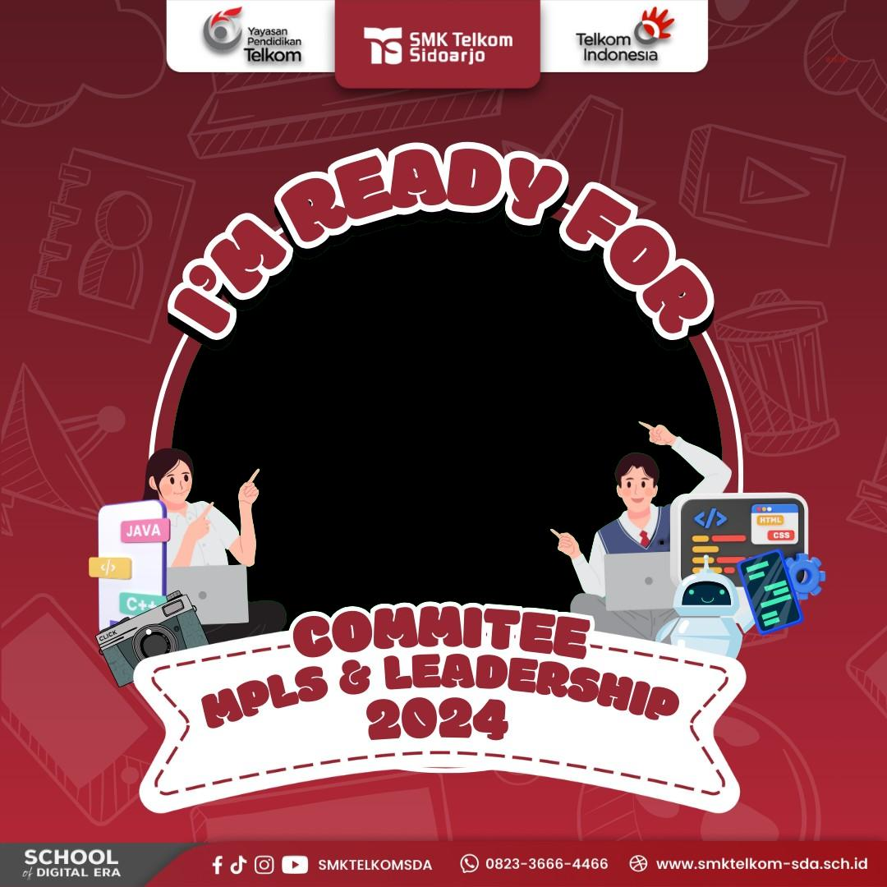

# MPLS SKOMDA TWIBBON 

<!--  -->
  

---

# Twibbon
Twibbon adalah sebuah aplikasi yang memungkinkan pengguna untuk membuat dan berbagi twibbon digital yang unik dan kreatif. Aplikasi ini dirancang untuk memudahkan pengguna dalam membuat twibbon yang sesuai dengan kebutuhan mereka, dengan fitur-fitur seperti:
* Membuat twibbon dengan berbagai bentuk dan desain
* Mengunggah gambar dan teks untuk menyesuaikan twibbon
* Berbagi twibbon melalui media sosial dan platform lainnya

# Tujuan
Tujuan dari project Twibbon adalah untuk memberikan kemudahan dan kreativitas dalam membuat twibbon digital yang unik dan menarik. Kami berharap bahwa aplikasi ini dapat membantu pengguna dalam meningkatkan kesadaran dan promosi terhadap berbagai kegiatan dan acara.

# Kontribusi
Kami mengundang Anda untuk bergabung dan berkontribusi pada project Twibbon ini. Jika Anda memiliki ide atau kemampuan yang dapat membantu meningkatkan aplikasi ini, silakan bergabung dan berkontribusi melalui GitHub.